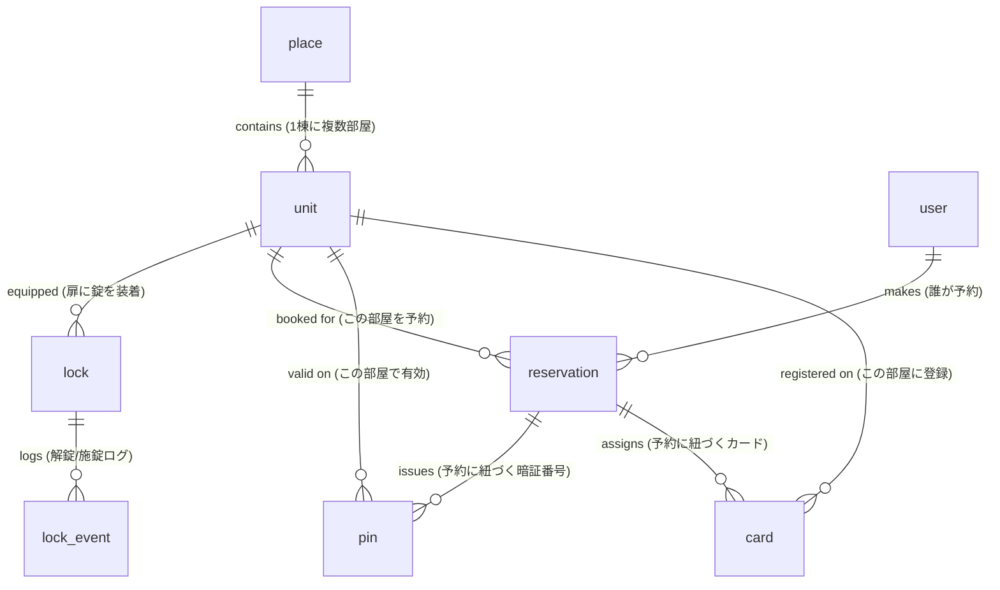

# KEYVOX エンティティリファレンス

KEYVOX API（MCP含む）が扱う主要リソースとその関係を整理した、全スキル共通の参照ドキュメント。

## 全体像

KEYVOX は**「場所(place) に置かれたスマートロック/ロッカーを、予約(reservation)に紐づいた PIN・カード・モバイル鍵で開閉する」**サービス。

## エンティティ関係図

## 7リソース仕様

### 1. `place` (場所)
**意味**: 物件単位の場所。マンション・ホテル・コワーキング1棟など。

| 主要フィールド | 説明 |
|---|---|
| `placeId` | 一意ID (MongoDB ObjectId形式、例: `5de0cbc9bb2f0c745b39ce00`) |
| `placeName` | 名称 (例: `BCLtest`) |
| `placeType` | カテゴリ。`hotel` / `locker` / `doubleLocker` / `vendingMachine` / `facility`（enums.md参照） |
| `placeAddress` | 住所 |
| `placeLat` / `placeLong` | 緯度経度 |
| `placeUtc` | UTCオフセット (例: 9 = JST) |
| `unitNum` | この場所に属するユニット数 |
| `deviceNum` | この場所に属するデバイス数 |
| `orgId` | 所属組織ID |

**取得**: `place_list`, `place_detail`, `place_availableList`

### 2. `unit` (部屋/ドア)
**意味**: place内の個別ドア（部屋・会議室）。**鍵発行の基本単位**。

| 主要フィールド | 説明 |
|---|---|
| `unitId` | 一意ID |
| `unitName` (または `unitNo`) | 部屋名 (例: `LINE入店エントランス`, `ドロップインドア`) |
| `unitType` | カテゴリ |
| `lockIds` | このユニットに紐づくスマートロックID配列（`getUnits` で取得可、`unit_list` には含まれない） |
| `placeId` | 所属する場所ID |
| `deviceNum` | このユニットに紐づくデバイス数 |

**取得**: `unit_list` (一覧), `unit_detail` (詳細), `getUnits` (lockIdが取れる簡易版)

**重要**: lockIdが必要な業務では `getUnits` を優先使用すること。`unit_list` は `deviceNum` しか返さないため、ロック直叩き系の前段に向かない。

### 3. `lock` (錠)
**意味**: unitに装着された物理スマートロック実機。

| 主要フィールド | 説明 |
|---|---|
| `lockId` | 一意ID (例: `QRZEURCMC2FWQ9OI`) |
| `lockType` | 機種 (例: `BCL-QR1`) |
| `relateType` | 関連ゲートウェイ機種 (例: `BCL-BR1`) |
| `wifi` | Wi-Fi接続状態 ("1"=接続) |
| `battery` | バッテリー残量（仮想ロックは "-"） |
| `status` | 開閉状態 |
| `reportTime` | 最終状態更新時刻 |

**取得**: `getLocks`, `getLockStatus`, `getLockHistory`

**操作**: `unlock`, `createLockPin`, `disableLockPin` 等

### 4. `pin` (暗証番号 / 鍵)
**意味**: unit に対して期間限定で発行する数字キー + 鍵URL。**予約に紐付けて発行されるのが典型**。

| 主要フィールド | 種別 | 説明 |
|---|---|---|
| `pin` (= `panelPin`) | 🟢 ゲスト配布可 | パネル直接入力用の暗証番号 |
| `qrShortUrl` | 🟢 ゲスト配布可 | スマホウォレット取込可の短縮鍵URL |
| `pinId` | 内部用 | 一意ID |
| `sTime` / `eTime` | 内部用 | 有効期間 (UNIX 秒) |
| `qrCode` | ⚠️ 配布禁止 | 内部トークン (断片値、QR画像生成には使えない) |
| `qrUrl` | ⚠️ 配布禁止 | QR画像URL (通常用途なし) |
| `shareUrl` | ⚠️ 配布禁止 | 別用途の共有URL |
| `urlKey` / `hashCode` / `downloadUrl` / `lockerQrUrl` 等 | ⚠️ 配布禁止 | いずれもゲスト配布対象外 |

**重要**: ゲスト配布に使うのは `pin`（暗証番号）と `qrShortUrl`（スマホウォレット取込可の短縮鍵URL）の **2 つのみ**。`qrCode` は内部トークン、`qrUrl` は画像、`shareUrl` は別用途で、いずれも通常配布しない。予約に紐づく鍵は `getReservation.unitPinList[]` でワンショット取得する。詳しい運用ルールは各 SKILL.md の「鍵情報の出力ルール」セクション参照。

**取得**: `getReservation` (推奨・上記 2 値を含む)。`getLockPinList` / `getLockPinStatus` / `getUnitPinList` は内部確認用途。

**操作**: `createLockPin`, `changeLockPin`, `disableLockPin`

**重要**: `getReservation` のレスポンスに `unitPinList` が含まれており、予約に紐づくPIN/QR情報をワンショットで取れる。

### 5. `card` (カード)
**意味**: ICカード/Felicaを鍵として登録（長期利用者向け）。

**取得**: `getLockCardList`, `getCardStatus`
**操作**: `setCard`, `addCard`, `updateCard`, `disableCard`

### 6. `user` (ユーザー)
**意味**: KEYVOXシステム上の利用者アカウント。

**取得/操作**: `createUser`, `updateUser`, `deleteUser`

### 7. `reservation` (予約)
**意味**: 「いつ・どのunitを・誰が」のレコード。**pin/card発行の起点**。

| 主要フィールド | 説明 |
|---|---|
| `orderId` | 予約ID (例: `QUPHLLMCI`) |
| `orderContact` | 予約者名 |
| `checkin` / `checkout` | 開始・終了時刻 (UNIX秒) |
| `unitId` | 対象ユニットID |
| `placeId` | 対象場所ID |
| `orderStateCode` | 予約ステータス（enums.md参照） |
| `payStateCode` | 支払ステータス（enums.md参照） |
| `channelCode` | 予約チャネル (例: `line`) |
| `contactTel` | 連絡先電話 |
| `unitPinList` | 紐づくPIN情報（getReservationのみ） |
| `deviceList` | 紐づくデバイス情報（getReservationのみ） |

**取得**: `listReservations`, `getReservation`, `get_reservations`
**操作**: `createReservation`, `updateReservation`, `cancelReservation`, `checkin`, `checkout`, `update_reservation_checkout`

## 関連ドキュメント
- 業務シナリオ→ツール対応: `keyvox-tool-map.md`
- 自然言語→ID変換: `keyvox-id-resolution.md`
- enum値（orderStateCode等）: `keyvox-enums.md`
