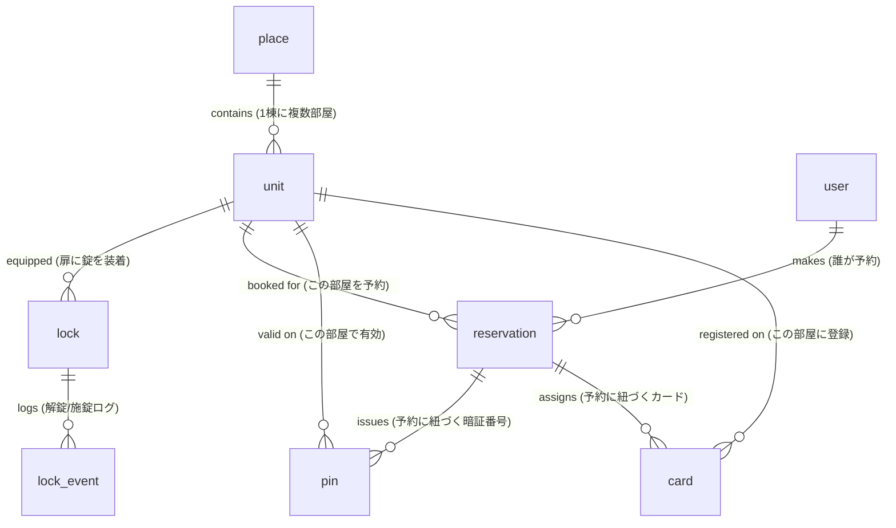

# KEYVOX エンティティリファレンス

KEYVOX API（MCP含む）が扱う主要リソースとその関係を整理した、全スキル共通の参照ドキュメント。

## 全体像

KEYVOX は**「場所(place) に置かれたスマートロック/ロッカーを、予約(reservation)に紐づいた PIN・カード・モバイル鍵で開閉する」**サービス。

## エンティティ関係図

## 7リソース仕様

### 1. `place` (場所)
**意味**: 物件単位の場所。マンション・ホテル・コワーキング1棟など。

| 主要フィールド | 説明 |
|---|---|
| `placeId` | 一意ID (MongoDB ObjectId形式、例: `5de0cbc9bb2f0c745b39ce00`) |
| `placeName` | 名称 (例: `BCLtest`) |
| `placeType` | カテゴリ。`hotel` / `locker` / `doubleLocker` / `vendingMachine` / `facility`（enums.md参照） |
| `placeAddress` | 住所 |
| `placeLat` / `placeLong` | 緯度経度 |
| `placeUtc` | UTCオフセット (例: 9 = JST) |
| `unitNum` | この場所に属するユニット数 |
| `deviceNum` | この場所に属するデバイス数 |
| `orgId` | 所属組織ID |

**取得**: `place_list`, `place_detail`, `place_availableList`

### 2. `unit` (部屋/ドア)
**意味**: place内の個別ドア（部屋・会議室）。**鍵発行の基本単位**。

| 主要フィールド | 説明 |
|---|---|
| `unitId` | 一意ID |
| `unitName` (または `unitNo`) | 部屋名 (例: `LINE入店エントランス`, `ドロップインドア`) |
| `unitType` | カテゴリ |
| `lockIds` | このユニットに紐づくスマートロックID配列（`getUnits` で取得可、`unit_list` には含まれない） |
| `placeId` | 所属する場所ID |
| `deviceNum` | このユニットに紐づくデバイス数 |

**取得**: `unit_list` (一覧), `unit_detail` (詳細), `getUnits` (lockIdが取れる簡易版)

**重要**: lockIdが必要な業務では `getUnits` を優先使用すること。`unit_list` は `deviceNum` しか返さないため、ロック直叩き系の前段に向かない。

### 3. `lock` (錠)
**意味**: unitに装着された物理スマートロック実機。

| 主要フィールド | 説明 |
|---|---|
| `lockId` | 一意ID (例: `QRZEURCMC2FWQ9OI`) |
| `lockType` | 機種 (例: `BCL-QR1`) |
| `relateType` | 関連ゲートウェイ機種 (例: `BCL-BR1`) |
| `wifi` | Wi-Fi接続状態 ("1"=接続) |
| `battery` | バッテリー残量（仮想ロックは "-"） |
| `status` | 開閉状態 |
| `reportTime` | 最終状態更新時刻 |

**取得**: `getLocks`, `getLockStatus`, `getLockHistory`

**操作**: `unlock`, `createLockPin`, `disableLockPin` 等

### 4. `pin` (暗証番号 / 鍵)
**意味**: unit に対して期間限定で発行する数字キー + 鍵URL。予約に紐付けて発行されるのが典型だが、予約と無関係なアドホック発行・ユーザー紐付き発行もある。

**ゲスト配布対象 (意味としては 2 つだけ)**:

| 意味 | 用途 |
|---|---|
| 暗証番号 | パネル直接入力 |
| ウォレット取込用URL | スマホウォレット取込可の短縮鍵URL |

**発行 / 取得経路ごとのフィールド名 (API ごとに違うので注意)**:

| 発行 / 取得API | 暗証番号フィールド | URLフィールド | 典型ケース |
|---|---|---|---|
| `getReservation.unitPinList[]` | `pin` (= `panelPin`) | `qrShortUrl` | 予約紐付きの鍵を一括取得 |
| `createLockPin` レスポンス | `pinCode` | `shortQrUrl` | 予約と無関係のアドホック発行 / 追加発行 |
| `issueLockKey` レスポンス | `pinCode` | `shortQrUrl` | ユーザー (アクセス権) 紐付きの発行 |

**配布禁止フィールド (出力も提案もしない)**:

| フィールド | 理由 |
|---|---|
| `qrCode` | ロック配信前提の内部トークン (`createLockPin` / `issueLockKey` / `getLockPinList` 等のレスポンスに出る)。QR 画像化はできるが、配布する必要がない |
| `qrUrl` | QR 画像 URL。通常配布対象外 |
| `shareUrl` | 別用途の共有 URL |
| `urlKey` / `hashCode` / `downloadUrl` / `lockerQrUrl` 等 | いずれもゲスト配布対象外 |

**重要**: ゲスト配布は **意味としては「暗証番号 + ウォレット取込URL」の 2 つだけ**。フィールド名は呼ぶ API によって `pin` / `qrShortUrl` か `pinCode` / `shortQrUrl` のどちらかになるので使い分けること。詳しい運用ルールは各 SKILL.md の「鍵情報の出力ルール」セクション参照。

**取得**:
- 予約紐付きの鍵: `getReservation` (推奨・`unitPinList[]` でワンショット取得)
- アドホック発行: `createLockPin` を呼んだレスポンスから直接取得
- ユーザー紐付き発行: `issueLockKey` を呼んだレスポンスから直接取得
- 内部確認用途: `getLockPinList` / `getLockPinStatus` / `getUnitPinList`

**操作**: `createLockPin`, `changeLockPin`, `disableLockPin`

**重要**: `getReservation` のレスポンスに `unitPinList` が含まれており、予約に紐づくPIN/QR情報をワンショットで取れる。

### 5. `card` (カード)
**意味**: ICカード/Felicaを鍵として登録（長期利用者向け）。

**取得**: `getLockCardList`, `getCardStatus`
**操作**: `setCard`, `addCard`, `updateCard`, `disableCard`

### 6. `user` (ユーザー)
**意味**: KEYVOXシステム上の利用者アカウント。

**取得/操作**: `createUser`, `updateUser`, `deleteUser`

### 7. `reservation` (予約)
**意味**: 「いつ・どのunitを・誰が」のレコード。**pin/card発行の起点**。

| 主要フィールド | 説明 |
|---|---|
| `orderId` | 予約ID (例: `QUPHLLMCI`) |
| `orderContact` | 予約者名 |
| `checkin` / `checkout` | 開始・終了時刻 (UNIX秒) |
| `unitId` | 対象ユニットID |
| `placeId` | 対象場所ID |
| `orderStateCode` | 予約ステータス（enums.md参照） |
| `payStateCode` | 支払ステータス（enums.md参照） |
| `channelCode` | 予約チャネル (例: `line`) |
| `contactTel` | 連絡先電話 |
| `unitPinList` | 紐づくPIN情報（getReservationのみ） |
| `deviceList` | 紐づくデバイス情報（getReservationのみ） |

**取得**: `listReservations`, `getReservation`, `get_reservations`
**操作**: `createReservation`, `updateReservation`, `cancelReservation`, `checkin`, `checkout`, `update_reservation_checkout`

## 関連ドキュメント
- 業務シナリオ→ツール対応: `keyvox-tool-map.md`
- 自然言語→ID変換: `keyvox-id-resolution.md`
- enum値（orderStateCode等）: `keyvox-enums.md`
